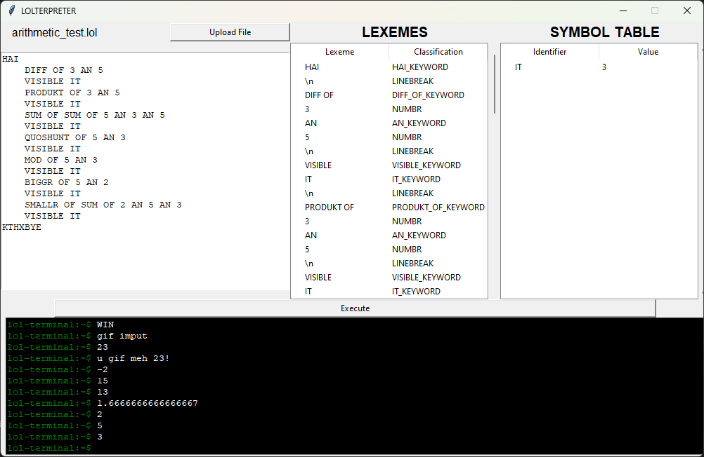

# LOLCODE Interpreter
This repository is a final project for CMSC  124 - Design and Implementation of Programming Languages. 

### Dependencies:
  Your computer must have Python 3.8 or above to run the program.
  Link: https://realpython.com/installing-python/ 
### Instructions:
  To run the program, go to the "src" directory and enter "python3 main.py" in your terminal.